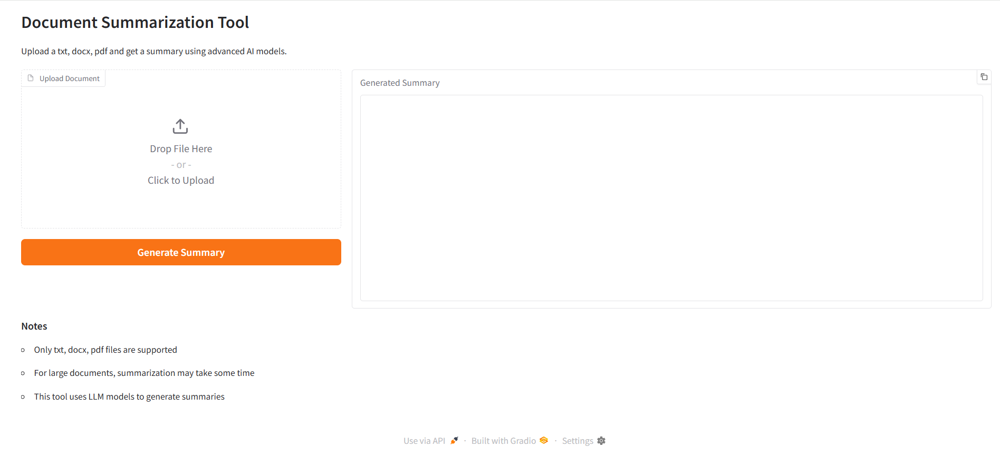

# Get Started: Document Summarization Application

## Overview

The Document Summarization Application enables you to upload documents and receive concise summaries generated by advanced AI models. The application provides a web UI and a REST API for a flexible interaction.



This section shows you how to:

- **Set up the sample application**: Use the Docker Compose tool to quickly deploy the application in your environment.
- **Run the application**: Execute the application to see real-time question and answering based on your data.

## Prerequisites

- Verify that your system meets the [minimum requirements](./system-requirements.md).
- Install Docker platform: [Installation Guide](https://docs.docker.com/get-docker/).
- Install Docker Compose tool: [Installation Guide](https://docs.docker.com/compose/install/).
- Install `Python 3.11` programming language.
- Access to required model files and API key, if applicable.
## Supported Models
All LLM models which are supported by the OpenVINO™ Model Server can be used with this sample application. The models can be downloaded from popular model hubs like Hugging Face. Refer to respective model hub documentation for details on how to access and download models. 

The sample application has been validated with a few models just to validate the functionality. This list is only illustrative and the user is not limited to only these models.

### LLM Models validated for each model server
| Model Server | Models Validated |
   |--------------|-------------------|
   | `OVMS` | `Intel/neural-chat-7b-v3-3`, `Qwen/Qwen2.5-7B-Instruct`, `microsoft/Phi-3.5-mini-instruct`, `meta-llama/Llama-3.1-8B-instruct`, `deepseek-ai/DeepSeek-R1-Distill-Qwen-7B` |

Note: Limited validation was done on DeepSeek model. 

### Getting access to models

To run a **GATED MODEL** like llama models, the user will need to pass their [huggingface token](https://huggingface.co/docs/hub/security-tokens#user-access-tokens). The user will need to request access to specific model by going to the respective model page in HuggingFace.

Visit https://huggingface.co/settings/tokens to get your token.

## Run the Application using Docker Compose

1. **Clone the Repository**:
    - Clone the Document Summarization Sample Application repository:
      ```bash
      git clone https://github.com/open-edge-platform/edge-ai-libraries.git edge-ai-libraries
      ```
      **Note**: Adjust the repo link appropriately in case of forked repo.

2. **Navigate to the Directory**:
    - Go to the directory where the Dockerfile is located:
      ```bash
      cd edge-ai-libraries/sample-applications/document-summarization
      ```

3. **Set Up Environment Variables**:
    - Set up the following environment variables:

      ```bash
      # OVMS Configuration
      export VOLUME_OVMS=<model-export-path-for-OVMS>  # For example, use: export VOLUME_OVMS="$PWD"
      export LLM_MODEL=<llm-model>

      # Docker Image Registry Configuration
      export REGISTRY="/intel"
      export UI_TAG=1.0
      export BACKEND_TAG=1.0
      ```
        > **Note:**  
        > OpenTelemetry and OpenLit configurations are optional. Set these only if there is an OTLP endpoint available.

        > ```bash
        >  export OTLP_ENDPOINT=<OTLP-endpoint>
        >  export no_proxy=${no_proxy},$OTLP_ENDPOINT,
        >   ```
      
    - Run the following script to set up the rest of the environment:

        ```bash
        source ./setup.sh
        ```
        
4. **Run the Docker Container**:
    - Run the Docker container using the built image:
      ```bash
      docker compose up
      ```
      
    - This will start:
     
        - The  OpenVINO™ model server service for model serving (gRPC: port 9300, REST: port 8300)
        
        - The FastAPI backend service (port 8090)
        
        - The Gradio UI service (port 9998)
        
        - The NGINX web server (port 8101)
          
5. **Verify the Application**:
   Check that the application is running:

   ```bash
   docker ps
   ```

6. **Access the Application**:
    - Open a browser and go to `http://<host-ip>:8101` to access the application dashboard. The application dashboard allows the user to:
    - Upload document and generate summary

## Running in Kubernetes Environment

Refer to [Deploy with Helm Chart](./deploy-with-helm.md) for the details. Ensure the prerequisites mentioned on this page are addressed before proceeding to deploy with Helm chart.

## Running Tests

- Ensure you follow all the steps from [unit test README](./../../tests/unit_tests/README.md) document.

## Advanced Setup Options

For alternative ways to set up the sample application, see:

- [How to Build from Source](./build-from-source.md)


## Supporting Resources

- [Docker Compose Documentation](https://docs.docker.com/compose/)
